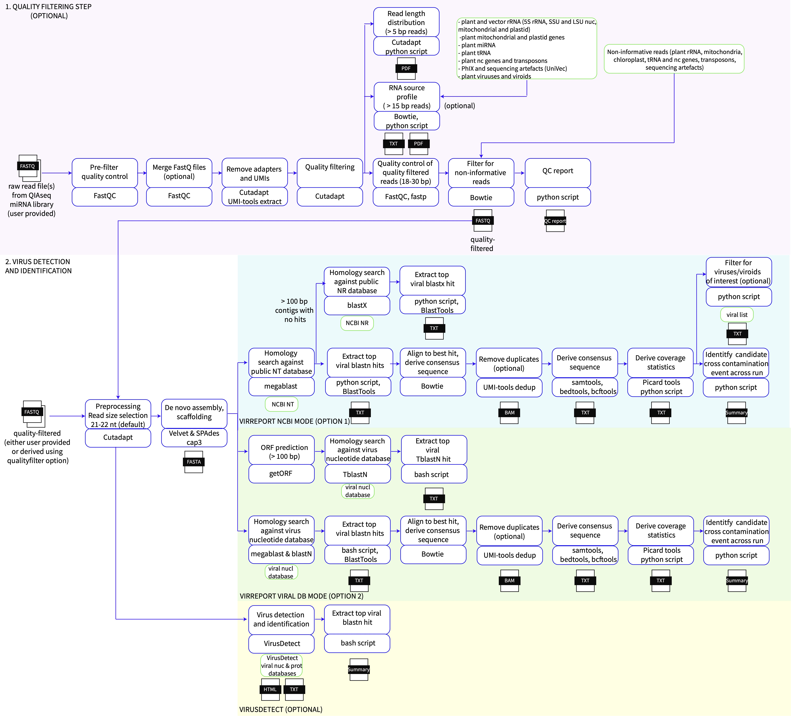

# VirReport workflow
## Authors
Roberto Barrero, 14/03/2019  
Desmond Schmidt, 2/7/2019  
Converted to Nextflow by Craig Windell, 11/2020  
Modified by Maely Gauthier 12/2021  

## About Pipeline

VirReport pipeline is based upon the scientific workflow manager Nextflow.
It is designed to help phytosanitary diagnostics of viruses and viroid pathogens in quarantine facilities. It takes small RNA-Seq fastq files as input. These can either be in raw format or quality-filtered.

# Run the Pipeline

## Test run
Download the pipeline and test it on a minimal dataset with a single command:
```bash
nextflow -c conf/test.config run eresearchqut/VirReport -profile test,conda --dedup --contamination_detection
```

Running this dataset requires 2 cpus and 8 Gb mem and should take 2 mins to complete.

## Run with your own data

Run the command:
```bash
nextflow run eresearchqut/VirReport -profile {docker or singularity or conda} --indexfile index_example.csv
```

Set the profile parameter to one of
```
docker
singularity
conda
```
To suit your environment.

The VirReport workflow will perform the following steps by default:
- Retain reads of a given length (21-22 nt long by default) from fastq file(s) provided in index.csv file (readprocessing)  
- De novo assembly using Velvet and SPades. Collapse contigs into scaffolds using cap3. By default, only contigs > 30 bp will be retained (denovo)
- Run megablast homology search against either NCBI NT or a local virus database:

Searches against NCBI NT and NR databases:
- Summarise megablast results and restrict to virus and viroid matches (blastn_nt_cap3)
- Derive coverage statistics, consensus sequence and VCF matching to top blast hits (covstats_nt)
- Run blastx on contigs > 100 bp long for which no match was obtained in the blastn search. Summarise the blastx results and restrict to virus and viroid matches (blastx).

Searches against a local virus database:
- Run blastn and megablast homology search on de novo assembly (derived with Velvet) against local  virus and viroid database (blast_nt_localdb_velvet, filter_blast_nt_localdb_velvet). An example of local virus database can be downloaded at wget https://data.researchdatafinder.qut.edu.au/dataset/60eed574-a745-4a0f-ab7c-fb8b3c711695/resource/a17dfa13-a093-407a-a047-27f134f92ac9/download/pvirdbv1.fasta.gz

A number of additional optional parameters can be specified:
```
      --contamination_detection: Run cross-sample contamination prediction (contamination_detection) 

      --blastn_method: The blastn homology search can be specified as blastn instead of megablast (--blastn_method blastn)

      --virusdetect: VirusDetect version 1.8 can be run in parallel

      --qualityfilter: performs a quality filtering on raw fastq files (currently specifically written for samples prepared using QIAGEN QIAseq miRNA library kit). The pipeline will also derive a qc report. 

      --targets: A text file with the taxonomy of the viruses/virioids of interest can be provided and only these will be retained in the megablast summary results derived at the filter_n_cov step.

      --spadesmem specifies the memory usage available for SPades.

      --cap3_len specifies the minimal length of contigs to retain after CAP3 scaffolding (by deafult 30)

      --blastn_evalue and --blastp_evalue specifies the evalue parameter to use during blast analyses (by deafult 0.001)

      --orf_minsize correspond to the minimal open reading frame getorf retains (by default 100 bp)

```
To enable these options, they can either be included in the nextflow run command provided in the PBS script: 
```
nextflow run eresearchqut/VirReport -profile {docker or singularity or conda} --indexfile index_example.csv --blastlocaldb --contamination_detection --virusdetect
```
or update parameter to true in the nextflow.config file. For instance:
```
params {
  blastlocaldb = true
  virusdetect = true
  contamination_detection = true
}
```
## Preparing the data
Preparing an index.csv file

You need to create a TAB delimited text file that will be the input for the workflow. By default the pipeline will look for a file called “index.csv” in the base directory but you can specify any file name using the --indexfile [filename] in the nextflow run command. This text file requires the following columns (which needs to be included as a header): ```sampleid,samplepath```

- sampleid will be the sample name that will be given to the files created by the pipeline
- samplepath is the full path to the fastq files that the pipeline requires as starting input

An index_example.csv is included in the base directory:
```
sampleid,samplepath
MT212,/work/diagnostics/2021/MT212_21-22bp.fastq
MT213,/work/diagnostics/2021/MT213_21-22bp.fastq
```
By default the pipeline will only retain 21-22 nt sRNA reads for downstream analysis but you can change this range in the nextflow.config file. For instance:
```
params {
  minlen = '18'
  maxlen = '25'
}
```
If you plan to run homology searches against public NCBI databases, you also need to download these databases at https://www.ncbi.nlm.nih.gov/books/NBK569850/. You will need to use the update_blastdb.pl script from the blast+ version you will use with your pipeline.

For example:
```
perl update_blastdb.pl --decompress nt [*]
perl update_blastdb.pl --decompress nr [*]
perl update_blastdb.pl taxdb
tar -xzf taxdb.tar.gz
```


Create a folder where you will store your NCBI database. It is good practice to include the date of download. For instance:
```
mkdir blastDB/30112021
```
Make sure the taxdb.btd and the taxdb.bti files are also present in the same directory. 

Specify the path of your local NCBI blast nt and nr directories in the nextflow.config file.


For instance:
```
params {
  blast_db_dir = '/work/hia_mt18005_db/blastDB/20220408'
}
```
If you want to run a blast analysis against a local database, please ensure you use NCBI BLAST+ makeblastdb to create the database. Then specify the full path to the database files including the prefix in the nextflow.config file. For example:
```
params {
  blast_local_db_path = '/path_to_viral_DB/viral_DB_name'
}
```
If you want to run the initial qualityfilter step, you will need to specify in the nextflow.config file the directory which holds the required bowtie indices to: 1) derive the origin of the filtered reads obtained (optional rna_source_profile process) and 2) filter non-informative reads (derive_usable_reads process). Examples of fasta files are available at https://github.com/maelyg/bowtie_indices.git and bowtie indices can be built from these using the command:

```
bowtie-build -f [fasta file] [name of index]
```

The location of the bowtie indices will need to specified in the nextflow.config file:
```
params {
  bowtie_db_dir = '/work/hia_mt18005_db/bowtie_idx'
}
```
If you want to run VirusDetect, then specify the path to the viral database directory in nextflow.config file. These can be downloaded at http://bioinfo.bti.cornell.edu/ftp/program/VirusDetect/virus_database/v248. For example:
```
virusdetect_db_path = '/home/gauthiem/code/VirusDetect_v1.8/databases/vrl_plant'
```

# Running the pipeline

## Outputs
The folders are structured as follows:
- 00_quality_filtering/Sample_name: this folder will output FASTQC of raw or filtered fastq files, cutadapt and umi_tools log files, a quality_trimmed.fastq.gz file and by default a fastq.gz file including reads only matching the size specified in the nextflow.config file)
- 00_quality_filter/qc_report: this folder contains summaries for all samples included in the index_example.csv file

- 01_VirReport/Sample_name/Assembly: fasta file which includes the assembled contigs before and after CAP3, for example MT020_velvet_assembly_21-22nt.fasta, MT001_velvet_cap3_21-22nt_rename.fasta
- 01_VirReport/Sample_name/blastn/NT: this folder contains all blastn results, filtered results limited to only viruses and viroid top 5 hit matches and the final BlastTools.jar summary output. For example: MT020_velvet_21-22nt_megablast_vs_NT.bls, MT020_velvet_21-22nt_megablast_vs_NT_top5Hits.txt, MT020_velvet_21-22nt_megablast_vs_NT_top5Hits_virus_viroids_final.txt, summary_MT029_velvet_21-22nt_megablast_vs_NT_top5Hits_virus_viroids_final.txt
Analysis using the local db will also be saved in this folder, for example:
MT001_velvet_21-22nt_blastn_vs_localdb.bls, summary_MT001_velvet_21-22nt_blastn_vs_localdb.bls_viruses_viroids_ICTV.txt
- 01_VirReport/Sample_name/blastx/NT: this folder contains getorf and blastp outputs. For example: MT020_velvet_21-22nt_getorf.min50aa.fasta, MT020_velvet_21-22nt_getorf.min50aa_blastp_vs_NR_out_virus_viroid.txt
- 01_VirReport/Sample_name/Assembly: this folder ontains filtered blast summary with various coverage statistics for each virus and viroid hit, and associated consensus fasta file and vcf file. For example: MT020_21-22nt_top_scoring_targets_with_cov_stats.txt, MT020_21-22nt_MK929590_Peach_latent_mosaic_viroid.consensus.fasta, MT020_21-22nt_MK929590_Peach_latent_mosaic_viroid_sequence_variants.vcf.gz
- 01_VirReport/Summary: this folder contains a summary of results for all samples included in the index.csv file. This summay table includes a cross-contamination prediction flag. For example: run_top_scoring_targets_with_cov_stats_with_cont_flag_21-22nt_0.01.txt

- 02_VirusDetect/Sample_name: this folder includes a results folder with blastn and blastx summary. For example: MT016_21-22nt.blastn.summary.txt and MT016_21-22nt.blastx.summary.txt